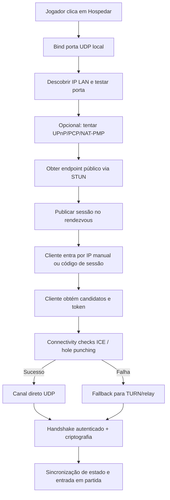
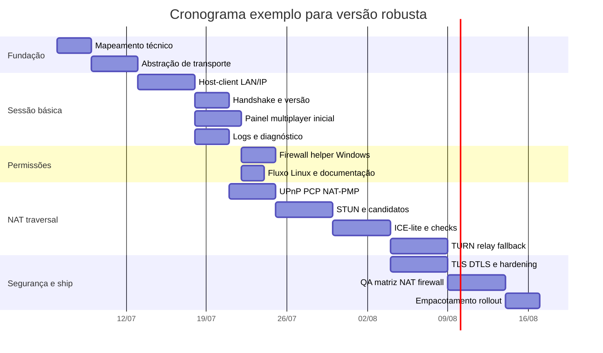

# Roadmap ultra detalhado para implementar multiplayer por IP direto em um jogo existente

## Resumo executivo

Se o objetivo é entregar **multiplayer por IP direto via Internet** em um jogo já existente, a rota mais segura para implementação real é **cliente-servidor hospedado pelo jogador** usando **UDP com camada de confiabilidade**, **rendezvous/sinalização mínima**, **NAT traversal por STUN/ICE**, **tentativa de abertura automática de porta via UPnP/PCP/NAT-PMP** e **fallback obrigatório para relay/TURN** quando a conexão direta falhar. STUN ajuda a descobrir o mapeamento e manter bindings, mas **não resolve traversal sozinho**; ICE é o mecanismo que coordena candidatos e connectivity checks usando STUN e TURN; TURN relaya tráfego quando P2P direto não é possível. citeturn3search0turn2search1turn2search2

Para um **jogo existente**, a recomendação prática quase nunca é um P2P full-mesh puro. O caminho com menor risco é: **um host atua como servidor da sessão**, os demais entram como clientes, e o seu código de rede fica encapsulado atrás de uma interface de transporte. Isso reduz complexidade de sincronização, simplifica validação de pacotes e evita multiplicar conexões entre todos os peers. Se o jogo for **Steam-only**, o atalho técnico mais forte é usar **SteamNetworkingSockets/Steam Datagram Relay**, porque a própria Valve já oferece criptografia, autenticação, relay, rate limiting e ocultação de IP. citeturn24view0turn24view1turn24view2

Se o jogo **já possui LAN funcional** e você quer um resultado rápido “estilo Hamachi”, existe uma rota muito mais curta: **overlay de rede/VPN virtual**. Hamachi se posiciona exatamente como uma forma de estender redes “LAN-like”; ZeroTier se descreve como uma secure peer-to-peer overlay network com conexão direta sempre que possível; Tailscale é uma plataforma de conectividade baseada em identidade; Radmin VPN cria redes locais virtuais e conecta máquinas atrás de firewalls. Essa abordagem reduz trabalho no código do jogo, mas piora UX, adiciona dependência externa e transfere parte da depuração para o sistema operacional e para a camada de rede virtual. citeturn19search2turn19search13turn19search0turn19search3

Em esforço, os cenários típicos ficam assim, assumindo **desktop Windows/Linux**, **2 a 8 jogadores**, **1 programador principal**, **sem requisitos de console/mobile**, e que o modelo de jogo/engine ainda não foi especificado:  
**overlay/VPN compatível com LAN existente**: 3 a 7 dias úteis;  
**IP direto manual + LAN + firewall + painel multiplayer**: 15 a 25 dias úteis;  
**IP direto robusto com NAT traversal e relay fallback**: 30 a 51 dias úteis;  
**Steam-only com SteamNetworkingSockets/SDR**: 10 a 20 dias úteis, dependendo de quanto do matchmaking/lobby já existe. Essas estimativas são analíticas e dependem fortemente do estado atual do código, da autoridade de simulação e da quantidade de UI e QA exigida.

## Premissas e objetivos

### Premissas declaradas

Como vários detalhes não foram especificados, este relatório assume o seguinte: o jogo é **PC desktop**, roda em **Windows e Linux**, a linguagem pode ser **C++, C#, Java, Godot/GDScript ou Unity/C#**, a base atual é **single-player ou LAN parcial**, e ainda não há uma pilha de matchmaking/NAT traversal pronta. Também assumo que você quer uma solução **pronta para produto**, não apenas um hack de teste.

Há alguns pontos importantes que permanecem **não especificados** e afetam o desenho final:  
o gênero do jogo, a necessidade de rollback vs snapshot/interpolation, o tick rate, o número máximo de jogadores por sala, se existe anti-cheat, se há conta/login, se a distribuição será Steam-only ou multiplataforma, e se a autoridade da simulação já está concentrada no host. Onde esses detalhes impactam o roadmap, eu marco a decisão como condicional.

### Objetivos do sistema

O sistema deve cumprir estes objetivos de implementação:

| Objetivo | Resultado esperado |
|---|---|
| Conexão por IP e LAN | Jogador consegue hospedar e outro jogador entrar por IP local ou público |
| Internet real | O sistema funciona atrás de NAT residencial quando possível |
| Fallback | Quando conexão direta falhar, há relay ou alternativa operacional |
| UX clara | Painel informa IP, porta, status, rota usada e erros acionáveis |
| Segurança mínima de produção | Handshake autenticado, tráfego protegido, validação rígida e rate limit |
| Operação desktop | Fluxo documentado para firewall/UAC em Windows e firewall/root em Linux |
| Observabilidade | Logs permitem distinguir bind, DNS, firewall, NAT, autenticação e relay |

### Critérios de sucesso

Os critérios de aceitação que realmente importam para validar a feature são estes:

1. **LAN**: dois clientes na mesma sub-rede conectam em menos de 5 segundos com taxa de sucesso acima de 95% em 20 tentativas.
2. **Internet com porta aberta**: host com port forwarding manual ou automático conecta cliente externo em menos de 10 segundos.
3. **Internet sem porta aberta**: quando NAT traversal direto falha, o sistema cai para relay/TURN ou informa a ação exata requerida.
4. **Firewall**: o jogo não pede para desabilitar firewall globalmente; ele oferece criação de regra específica por app/porta. A Microsoft recomenda não desabilitar o Windows Firewall e documenta automação por PowerShell/netsh e por interfaces COM. citeturn30view0turn18search1turn1search8
5. **Segurança**: pacotes inválidos, oversized, fora de janela, sem token ou com versão incompatível são descartados sem travar sessão.
6. **Logs**: cada tentativa de conexão grava serviço de descoberta, endereço local, endereço público, porta, candidatos ICE ou motivo de falha, rota escolhida e código de erro operacional.
7. **Suporte**: o time consegue reproduzir um problema usando Wireshark/tcpdump/Pktmon e os logs internos. Wireshark tem suporte formal a capture/display filters; tcpdump faz dump de tráfego por expressão BPF; o Packet Monitor do Windows é ferramenta nativa para captura, contadores e detecção de drops. citeturn12search4turn12search19turn13search0turn29view1

## Arquiteturas e decisão recomendada

### Opções arquiteturais

Há quatro caminhos principais para multiplayer “por IP” em jogo existente:

| Arquitetura | Onde ela brilha | Principais vantagens | Principais custos |
|---|---|---|---|
| **P2P full-mesh** | Jogos muito pequenos, baixa contagem de peers, coop casual | Menor dependência de host único; sem servidor dedicado | Conexões explodem com número de jogadores; NAT traversal mais difícil; mais superfície de fraude e desync |
| **Cliente-servidor hospedado pelo jogador** | Melhor padrão para jogo já existente | Mais simples de integrar; um peer centraliza autoridade; NAT traversal fica concentrado no host | Host fica exposto; se host cair, sala cai; precisa relay para casos ruins |
| **Servidor dedicado** | Competitivo, persistente, anti-cheat, alta escala | Melhor controle, menor exposição de jogadores, autoridade forte | Mais custo operacional, backend, deploy e observabilidade |
| **Overlay LAN-over-Internet** | Jogo que já tem LAN funcional | Menor mudança no código do jogo; muito rápido de provar conceito | Pior UX, depende de VPN/overlay, troubleshooting fora do jogo, instalação extra |

Para o seu caso específico, **cliente-servidor hospedado pelo jogador** é a decisão recomendada como base, com uma **camada de compatibilidade opcional para overlay/VPN** como plano B rápido. Essa decisão é coerente com o estado da prática em engines e SDKs de jogos: Godot usa ENet/UDP para multiplayer de alto nível e deixa claro que, para Internet, normalmente será necessário port forwarding em UDP; Unity também distingue networking direto de Relay e recomenda Relay/Distributed Authority em jogos client-hosted para proteger NAT, firewalls e IP dos jogadores. citeturn10search0turn10search3turn25search2turn25search7

### Recomendação principal

A arquitetura recomendada para implantação incremental é:

1. **Camada de transporte abstrata** no jogo.
2. **Modo host-client por UDP**.
3. **Modo manual de conexão por IP** para debug, LAN e suporte.
4. **Serviço leve de sinalização/rendezvous** via HTTPS/TLS para troca de endpoints e tokens.
5. **Ladder de conectividade**: LAN direta → IP público/manual → UPnP/PCP/NAT-PMP → STUN + hole punching + ICE → relay/TURN.
6. **Segurança por sessão**: token de handshake, autenticação opcional do usuário, criptografia do transporte e validação estrita dos payloads.
7. **Telemetria de rota**: direto, direto via porta mapeada, direto via ICE, relay.

Essa abordagem permite começar simples e crescer sem reescrever o jogo inteiro.

### Tabela comparativa de bibliotecas e APIs

| Biblioteca/API | Linguagem/ecossistema | O que ela faz bem | Limitações práticas | Recomendação |
|---|---|---|---|---|
| **Sockets nativos** | C++/Winsock, .NET, Java | Controle total do protocolo e integração mínima; APIs oficiais em todas as plataformas. citeturn8search10turn8search1turn8search7 | Você implementa confiabilidade, criptografia, fragmentação, NAT traversal e observabilidade praticamente sozinho | Melhor quando você já tem equipe forte de rede |
| **ENet** | C/C++, wrappers em engines | UDP com confiabilidade opcional, ordenação e fragmentação; amplamente usado em jogos. citeturn6search4turn22view0 | A própria documentação ressalta que ENet **omite autenticação, lobby, discovery e criptografia**. citeturn6search4 | Excelente para host-client se você adicionar segurança e signaling |
| **Godot ENetMultiplayerPeer** | Godot/GDScript/C# | Integração nativa em Godot, criação de client/server simples, usa UDP; Godot também fornece UPNP e suporte a DTLS na camada ENet host. citeturn10search3turn26search0turn10search9 | Continua exigindo tratamento de NAT/firewall e UX de produto | Melhor caminho para jogo Godot |
| **Unity Transport + NGO** | Unity/C# | Transporte oficial low-level para multiplayer e configuração direta por endereço/porta com `SetConnectionData`; `StartHost`, `StartServer` e `StartClient` são oficiais. citeturn8search4turn11search6turn11search4 | Networking direto expõe IPs; Unity recomenda Relay/Distributed Authority em client-hosted games. citeturn25search2turn25search7 | Melhor caminho se o jogo já é Unity |
| **Lidgren** | C#/.NET | API UDP simples e conhecida no mundo .NET; usa um único socket UDP. citeturn23view0 | O projeto informa que **não é mais ativamente desenvolvido**, aceitando só bugfixes triviais/menores. citeturn23view0 | Usar apenas se já existir no projeto |
| **RakNet** | C++ | Histórico forte em jogos e vários recursos legados. citeturn20view0 | Repositório oficial foi **arquivado em 2022** e está read-only. citeturn20view0 | Não recomendado para projeto novo |
| **SteamNetworkingSockets / SDR** | Steamworks / C++ / wrappers | API orientada a jogos, mensagens confiáveis e não confiáveis, criptografia forte, autenticação, relay, ocultação de IP, proteção contra DoS e suporte a P2P e cliente-servidor. citeturn24view0turn24view1turn24view2 | Exige ecossistema Steam/Steamworks; recursos cross-platform fora Steam dependem de requisitos adicionais e coordinator | Melhor opção se todos os jogadores usam Steam |
| **ISteamNetworkingMessages** | Steamworks | Parecido com UDP/sendto, útil para portar código UDP existente. citeturn24view0turn24view2 | Ecossistema Steam | Ótimo se você quer preservar semântica UDP |
| **MiniUPnPc / UPNP de engine** | C/C++ e wrappers | Automação de port mapping local em roteadores compatíveis UPnP IGD. MiniUPnPc é cliente UPnP IGD; Godot tem classe `UPNP`. citeturn4search3turn26search0 | Só funciona se o roteador suportar e permitir; não resolve CGNAT | Use como aceleração, nunca como única estratégia |
| **coturn** | Infra para STUN/TURN | Implementação amplamente usada de STUN/TURN self-hosted. citeturn28search0turn28search11 | Mantém custo operacional e consumo de banda de relay | Recomendado para fallback de produção fora Steam |

### Quando considerar overlay em vez de integração nativa

Se o jogo **já tem descoberta LAN, sessões LAN e sincronização LAN funcionando**, o overlay pode ser a forma mais rápida de “vender” multiplayer remoto. Hamachi se vende exatamente como hosted VPN que estende redes do tipo LAN; ZeroTier entrega uma overlay peer-to-peer segura com conexões diretas sempre que possível; Radmin VPN cria “virtual local networks”; Tailscale é mais voltado a conectividade segura baseada em identidade do que a UX de lobby de jogo, mas tecnicamente cumpre o papel de overlay. citeturn19search2turn19search13turn19search3turn19search0

Eu só recomendaria overlay como solução principal se pelo menos uma destas condições for verdadeira:  
o jogo já está pronto em LAN e você precisa reduzir prazo drasticamente;  
o projeto não pode introduzir backend agora;  
ou a equipe ainda não quer assumir operação de relay/TURN.

### Fluxo de decisão de conexão



## Conectividade, NAT traversal e permissões

### Requisitos de rede

A pilha mínima recomendada de portas é esta:

| Função | Protocolo | Exposição | Observação |
|---|---|---|---|
| Gameplay host-client | UDP | Inbound no host | Porta do jogo, ex.: 27015/udp |
| Sinalização/rendezvous | HTTPS/TCP | Outbound | Idealmente 443/tcp |
| STUN | UDP/TCP | Outbound | STUN é ferramenta auxiliar para NAT traversal, não solução completa. Portas clássicas registradas incluem 3478 e STUNS/TURNS 5349. citeturn3search0turn3search6 |
| TURN/relay | UDP/TCP/TLS/DTLS | Outbound do cliente; inbound no relay | Necessário para casos em que direção direta falha. citeturn2search2turn28search0 |

Em Internet pública, **não confie em broadcast LAN**. Broadcast/multicast podem funcionar dentro da rede local, mas o fluxo Internet-friendly deve ser sempre **join por IP/porta**, **join por código de sessão** ou **convite**.

### NAT traversal na prática

A sequência correta de implementação é esta:

**STUN**: peça ao peer que descubra o IP/porta mapeados pelo NAT e use isso como candidato. O RFC do STUN moderno deixa claro que STUN é um **tool** usado por outras soluções e pode descobrir IP/porta externa, checar conectividade e manter binding do NAT. Também deixa claro que STUN **não é uma solução de NAT traversal por si só**. citeturn3search0turn3search5

**Hole punching UDP**: use quando ambos os peers conseguem trocar candidatos e enviar pacotes simultaneamente. O material do IETF sobre P2P/NAT traversal documenta hole punching UDP como técnica central e também descreve limitações como hairpinning e NATs mais difíceis. citeturn2search3turn16search14turn16search0

**ICE**: trate ICE como a camada de orquestração que decide entre candidatos locais, reflexivos e relay. O RFC 8445 define ICE para NAT traversal de comunicação baseada em UDP, explicitamente usando STUN e TURN. citeturn2search1

**TURN**: quando a rede do usuário estiver atrás de CGNAT, NAT simétrico, regras corporativas restritivas ou alguma combinação em que hole punching falha, relaye o tráfego. Isso aumenta custo e latência, mas preserva conectividade. O RFC 8656 define TURN exatamente para esse cenário. citeturn2search2

**Não baseie o produto em “NAT type detection” clássico**. O RFC 5389/8489 abandonou a ideia de que STUN seria uma solução completa e registrou que NAT type detection do STUN clássico era frágil demais diante da variedade de NATs reais. Em produto, prefira **connectivity checks reais**, não branchs rígidos por “tipo de NAT”. citeturn3search6turn3search0

### Tabela comparativa de técnicas NAT

| Técnica | Resolve o quê | Falha típica | Custo de latência | Esforço | Veredito |
|---|---|---|---|---|---|
| **Port forwarding manual** | Host com porta fixa e acesso externo | Usuário não sabe configurar; CGNAT impede | Baixo | Baixo | Tenha como opção de suporte |
| **UPnP IGD** | Abre porta automaticamente no roteador local | Roteador sem suporte ou política bloqueando | Baixo | Baixo a médio | Muito útil como aceleração |
| **NAT-PMP / PCP** | Mapeamento automático e controle do gateway/firewall | Suporte inconsistente no parque de roteadores | Baixo | Médio | Melhor que depender só de UPnP |
| **STUN + hole punching** | Muitos NATs residenciais comuns | NATs mais restritivos, CGNAT, firewall corporativo | Baixo | Médio | Recomendado como camada padrão |
| **ICE completo** | Seleção robusta entre candidatos | Ainda depende de TURN nos casos ruins | Baixo a médio | Médio a alto | Recomendado para produto |
| **TURN/relay** | Conectividade quase universal | Custo de banda e maior latência | Médio | Médio a alto | Obrigatório como fallback |
| **Overlay VPN** | Faz o jogo “enxergar LAN” | UX ruim, instalação externa, troubleshooting de SO | Médio | Baixo no jogo / alto no suporte | Boa alternativa operacional |

As referências normativas para essa tabela são: ICE usa STUN e TURN; STUN descobre mapeamentos e faz keepalive, mas não resolve tudo sozinho; TURN relaya quando necessário; NAT-PMP automatiza mapeamento e PCP o sucede como padrão IETF; UPnP IGD segue especificações da OCF para gateways residenciais. citeturn2search1turn3search0turn2search2turn4search1turn4search2turn5search0

### UPnP, NAT-PMP, PCP e port forwarding automático

Sua lógica de automação deve ser:

1. detectar gateway local;
2. tentar UPnP IGD;
3. tentar PCP/NAT-PMP quando biblioteca suportar;
4. verificar se o mapeamento foi criado;
5. publicar porta externa;  
6. se falhar, seguir para STUN/ICE e enfim relay.

PCP permite que um host controle como pacotes IPv4/IPv6 de entrada são traduzidos/encaminhados por NAT ou firewall e optimize NAT keepalives; NAT-PMP automatiza criação de mapeamentos NAT e descoberta do endereço externo do gateway; o IGD v2.0 da OCF é a linha atual de referência para gateways UPnP. citeturn4search2turn4search1turn5search0

No stack de engine, há atalhos úteis. Em Godot, a classe `UPNP` permite descoberta de gateway e `add_port_mapping`, mas os métodos são síncronos e podem bloquear a thread chamadora, então devem ficar fora do frame crítico ou em thread dedicada. citeturn26search0turn26search1

### Windows

No Windows, trabalhe com três perfis de firewall: **Domain, Private e Public**. A própria documentação da Microsoft explica que o firewall suporta esses perfis e que as regras podem ser mais precisas por perfil. Para jogo hospedado por usuário, o padrão sensato é **habilitar inbound só em Private por default**; Public deve ser opt-in explícito e acompanhado de aviso. citeturn30view0turn30view1turn1search2

Use **`netsh advfirewall`**, não o contexto antigo `netsh firewall`, porque a Microsoft recomenda `advfirewall` e documenta que o contexto antigo pode ser descontinuado. A documentação também mostra exemplos formais para abrir programa e porta, e deixa claro que, com UAC habilitado, esses comandos exigem prompt elevado. citeturn30view1turn0search5

Para fluxos automatizados, há duas abordagens válidas:

- **Helper elevado + netsh/PowerShell**: mais fácil de empacotar, menos código nativo.
- **Interfaces COM do firewall**: `INetFwPolicy2`, `INetFwRule`, `INetFwRules::Add`, melhor para integração fina; `Add` pode retornar `E_ACCESSDENIED` em problema de permissões. citeturn1search8turn18search0turn18search1turn18search8

No nível de UAC, a Microsoft documenta `asInvoker`, `highestAvailable` e `requireAdministrator`. Para um jogo, a recomendação prática é: **mantenha o jogo principal como `asInvoker`** e eleve **apenas** um helper de firewall quando o jogador escolher hospedar. Rodar o executável principal inteiro como `requireAdministrator` piora UX e distribuição. citeturn1search3turn1search14turn1search1

Nunca peça ao usuário para “desativar o firewall”. A Microsoft recomenda não desabilitá-lo, porque isso remove proteções e pode causar incompatibilidades. citeturn30view0turn1search16

### Linux

No Linux, a base é o **netfilter** no kernel. `iptables` e `nftables` são interfaces para esse subsistema; o projeto netfilter.org e a documentação da Red Hat tratam `nftables` como sucessor/rota recomendada para novos scripts, enquanto `iptables` continua existindo em muitos ambientes como camada de compatibilidade. Ubuntu usa `ufw` como frontend amigável de host firewall; `firewalld` é comum em Fedora/RHEL e mantém configurações runtime e permanent. citeturn31view0turn14search7turn14search2turn32view1turn15search5turn15search4

Na prática, **não existe um prompt universal de “permitir conexão de entrada para este app” equivalente ao fluxo típico do Windows**. Em Linux desktop, você precisa escolher uma estratégia operacional:

- documentar comandos para `ufw`, `firewall-cmd`, `nft` e `iptables`;
- opcionalmente empacotar helper com `pkexec`/sudo;
- ou não abrir firewall automaticamente e apenas mostrar instruções claras no painel multiplayer.

Para novos ambientes, eu recomendo priorizar **ufw** quando o alvo é Ubuntu/Desktop e **firewalld** quando o alvo é Fedora/RHEL; manter **iptables/nft** como instrução avançada. A documentação da Red Hat também alerta para não manter múltiplas ferramentas de firewall competindo no mesmo host. citeturn31view0turn32view1

### Fluxo UX para permissões de rede

O painel multiplayer deve tratar permissões como parte do produto, não como detalhe técnico esquecido.

**Fluxo recomendado ao clicar em Hospedar**:

1. verificar se a porta local consegue fazer bind;
2. verificar se já existe regra de firewall suficiente;
3. se faltar, mostrar diálogo curto e específico;
4. pedir consentimento para criar regra apenas para a porta/programa do jogo;
5. se o usuário negar, oferecer “copiar instruções”;
6. continuar hospedando LAN local mesmo sem Internet, quando possível;
7. mostrar no status se a rota provável é LAN, direta, UPnP, ICE direta ou relay.

Texto sugerido para Windows:

> Para aceitar conexões de outros jogadores pela Internet, o jogo precisa criar uma regra de entrada UDP no Firewall do Windows para redes Privadas. Isso requer permissão de administrador. Não desative o firewall inteiro. Deseja permitir agora?

Texto sugerido para Linux:

> Para aceitar conexões de outros jogadores, seu firewall precisa permitir tráfego UDP na porta do jogo. O Linux não possui um fluxo universal de permissão por app. Copie um comando compatível com seu sistema ou execute via sudo.

## Segurança, UX, testes e observabilidade

### Segurança de transporte e autenticação

Se você usar **TCP** para controle/sinalização, proteja com **TLS 1.3**. Se você usar **UDP** customizado, proteja com **DTLS** ou use uma pilha que já entregue proteção equivalente. TLS 1.3 e DTLS 1.3 existem exatamente para prevenir escuta, adulteração e message forgery; DTLS 1.3 é a versão correspondente para aplicações client/server sobre datagramas. citeturn17search0turn17search1

Para engines/stacks:

- **ENet puro não resolve autenticação/crifra**; você precisa adicionar isso por fora. citeturn6search4
- **SteamNetworkingSockets** já oferece autenticação forte, criptografia e relay. citeturn24view0turn24view1
- **Godot ENetConnection** expõe configuração DTLS no host. citeturn10search9
- Em Unity, a documentação moderna empurra fortemente Relay para jogos client-hosted expostos à Internet, principalmente por NAT/firewall e privacidade de IP. citeturn25search0turn25search2

A segurança mínima recomendada da sessão é esta:

| Camada | Medida |
|---|---|
| Handshake | Token de sessão assinado pelo backend ou código de convite assinado |
| Transporte | TLS para signaling; DTLS ou transporte equivalente para UDP |
| Pacotes | Header com versão, tipo, tamanho, sequence, nonce, flags |
| Anti-spoof | Cookie/challenge antes de aceitar payload pesado |
| Integridade | MAC/AEAD no transporte ou assinatura do frame |
| Rate limit | Por IP, por sessão e por tipo de pacote |
| Validação | Tamanho máximo, ranges, enums válidos, ordem de estado |
| Compatibilidade | Rejeitar cliente com versão/protocol hash divergente |

### DDoS, privacidade de IP e limites reais do “IP direto”

Aqui é importante ser direto: **IP direto expõe o host**. Isso é verdade tanto do ponto de vista operacional quanto de privacidade. A própria documentação da Unity diz que, em client-hosted games com direct networking, os endereços IP dos jogadores ficam visíveis ao host e que a prática recomendada é usar Relay ou Distributed Authority para lidar com NAT, firewall e IPs. A documentação da Valve vai ainda mais longe: SDR relaya tráfego, oculta IPs, autentica, criptografa e rate-limita, protegendo de DoS. citeturn25search2turn24view1

Então a regra de produto é:

- **modo manual por IP** existe, mas é avançado;
- **modo padrão do usuário comum** deve ser NAT traversal com relay fallback;
- se a distribuição for Steam-only, considere seriamente **usar SteamNetworkingSockets/SDR como padrão**.

### UI/UX do painel multiplayer

O painel multiplayer precisa expor estado operacional suficiente para o usuário e para o suporte. O desenho mínimo que recomendo é este:

| Área | Campos |
|---|---|
| Hospedar | porta local, copiar IP LAN, copiar IP público, botão “Permitir no firewall”, botão “Tentar abrir porta” |
| Entrar | IP/host, porta, código opcional de sessão, botão conectar |
| Status | bind local, firewall, UPnP/PCP, STUN, ICE, relay, ping |
| Diagnóstico | erro amigável + código técnico + botão copiar log |
| Segurança | indicador “rota direta” vs “rota protegida por relay” |
| Avançado | selecionar interface, forçar IPv4/IPv6, mudar porta, log verbose |

Os estados de status devem ser explícitos e curtos:

- **LAN detectada**
- **Porta aberta no roteador**
- **Conexão direta estabelecida**
- **Conexão via relay**
- **Firewall bloqueando entrada**
- **NAT restritivo; relay necessário**
- **Versão incompatível**
- **Token inválido ou expirado**

### Ferramentas e estratégia de testes

As ferramentas mais úteis para essa feature são:

| Ferramenta | Uso principal |
|---|---|
| Wireshark | Captura e análise de handshake, perda, RTT e payloads |
| tcpdump | Captura headless em Linux/CI |
| Pktmon | Captura nativa no Windows, filtros e drop detection |
| iperf3 | Medir banda, jitter e perda em testes controlados |
| netcat/ncat | Testes rápidos de bind, listen e reachability TCP/UDP |
| Logs internos | Diagnóstico de sessão, NAT, firewall, escolha de rota |

Wireshark documenta capture filters e display filters; tcpdump grava tráfego por expressão; Pktmon é nativo no Windows e possui `filter`, `start`, `stop`, `counters`, `etl2pcap`; iperf3 mede throughput e perda; nc/ncat abre/listen em TCP ou UDP e é excelente para smoke tests. citeturn12search4turn12search19turn13search0turn29view1turn12search14turn12search11turn12search7

Exemplos operacionais úteis:

```bash
# Linux: capturar somente tráfego do jogo
sudo tcpdump -ni any udp port 27015 -w multiplayer.pcap
```

```bash
# Linux/Windows com iperf3 instalado: testar UDP entre duas máquinas
iperf3 -s
iperf3 -c <ip-do-servidor> -u -b 5M -t 20
```

```bash
# Teste rápido de escuta UDP com nc/ncat
ncat -ul 27015
```

No Windows, mantenha também um procedimento padrão com **Pktmon** e conversão para `pcapng` quando precisar levar o tráfego para Wireshark. O próprio comando oficial expõe `start`, `stop`, `etl2pcap` e `filter`. citeturn29view1

### Checklist de QA e deploy

| Categoria | Verificação |
|---|---|
| LAN | dois peers na mesma sub-rede; IP local correto; sem relay |
| Internet básica | host com porta encaminhada recebe cliente externo |
| Automação | UPnP/PCP/NAT-PMP tentam mapear e registram sucesso/erro |
| NAT difícil | quando direto falha, relay entra sem travar UI |
| Firewall Windows | regra criada em Private; Public só se usuário pedir |
| Firewall Linux | instrução correta para ufw/firewalld/nft/iptables |
| Segurança | token expirado, pacote malformado e replay são rejeitados |
| Robustez | fechar host durante conexão; timeout; reconnect |
| Compatibilidade | versão antiga recebe erro claro de protocolo |
| Observabilidade | logs têm session_id, route, endpoint, códigos de erro |
| Empacotamento | helper elevado assinado e separado do executável principal |
| Suporte | botão “copiar diagnóstico” inclui dados úteis e sanitizados |

## Roadmap, cronograma e critérios de aceitação

### Ordem de implementação recomendada

A ordem abaixo evita retrabalho:

1. **abstração de transporte**;
2. **host-client LAN/IP manual**;
3. **painel multiplayer e logs**;
4. **Windows firewall helper**;
5. **Linux instruções + helper opcional**;
6. **UPnP/PCP/NAT-PMP**;
7. **STUN + hole punching**;
8. **ICE/checks e seleção de rota**;
9. **TURN/relay fallback**;
10. **segurança completa da sessão**;
11. **QA matriz NAT/firewall**;
12. **empacotamento e rollout gradual**.

### Milestones com esforço, dependências e aceitação

Assumindo 1 dia útil = 8 horas.

| Entrega | Tarefa técnica | Estimativa | Dependências | Critério de aceitação |
|---|---|---:|---|---|
| Fundação | Mapear código atual de simulação, serialização e loop de rede | 8–16 h | nenhuma | documento com pontos de integração |
| Fundação | Criar interface `ITransport` / `ISessionTransport` | 16–24 h | mapeamento | jogo compila com stub e transporte mock |
| Sessão básica | Implementar host-client LAN/IP manual | 24–40 h | abstração | cliente conecta ao host por IP local e público |
| Sessão básica | Handshake mínimo com versão, nonce e session token | 12–20 h | sessão básica | versão incompatível é rejeitada com erro claro |
| Produto | Painel multiplayer inicial com host/join/status | 16–24 h | sessão básica | usuário consegue hospedar, copiar IP e conectar |
| Windows | Helper/UAC + criação de regra por `netsh` ou COM | 12–20 h | painel | regra Private UDP criada sem desativar firewall |
| Linux | Fluxo `ufw`/`firewalld`/`nft`/`iptables` e cópia de comandos | 8–16 h | painel | usuário consegue aplicar regra adequada ao distro target |
| Diagnóstico | Logs estruturados, códigos de erro e “copiar diagnóstico” | 12–20 h | sessão básica | suporte consegue diferenciar bind/firewall/NAT |
| NAT local | Integrar UPnP e opcional PCP/NAT-PMP | 16–28 h | sessão básica | host detecta/abre mapeamento quando roteador permite |
| NAT público | Integrar STUN + keepalive + candidatos reflexivos | 24–40 h | sessão básica | host e cliente obtêm endpoint público e testam direto |
| NAT público | Implementar connectivity checks estilo ICE-lite | 24–40 h | STUN | sistema escolhe rota direta quando possível |
| Fallback | Integrar TURN/relay self-hosted ou serviço terceiro | 24–40 h | STUN/checks | sessão sobe mesmo onde direto falha |
| Segurança | DTLS/TLS, rate limit, cookie/challenge e validação dura | 24–40 h | sessão básica | fuzz simples não derruba host nem consome CPU excessiva |
| QA | Matriz de testes NAT/firewall e automação de smoke tests | 24–40 h | quase tudo | taxa de sucesso documentada por cenário |
| Release | Empacotamento, assinatura, feature flag e rollout | 12–20 h | QA | build release reproduzível e rollback pronto |

**Esforço total estimado**: **244 a 408 horas**, ou **30,5 a 51 dias úteis** para a versão completa com NAT traversal robusto e relay fallback.  
**Caminho reduzido** sem TURN/relay e sem ICE completo: **120 a 200 horas**, ou **15 a 25 dias úteis**.  
**Caminho Steam-only** com SteamNetworkingSockets/SDR desde o início: normalmente reduz o bloco de NAT/firewall/segurança substancialmente. citeturn24view0turn24view1turn24view2

### Cronograma exemplo



### Riscos, mitigação e alternativas

| Risco | Impacto | Mitigação | Alternativa |
|---|---|---|---|
| CGNAT / NAT muito restritivo | Alto | Relay/TURN obrigatório | Overlay VPN ou Steam SDR |
| Firewall/UAC friccionando usuário | Alto | Helper dedicado, regra Private apenas, UX clara | Manual assistido com copiar comando |
| Exposição do IP do host | Alto | Relay padrão para público geral | Steam SDR / Unity Relay / serviço equivalente |
| Biblioteca desatualizada | Médio | Evitar RakNet novo e tratar Lidgren como legado | ENet, sockets nativos, Unity/Godot/Steam oficiais |
| Desync por autoridade mal definida | Alto | Fixar host como autoridade da sessão | Dedicated server para competitivo |
| Suporte caro em Linux | Médio | Documentar ufw/firewalld/nft/iptables claramente | Limitar suporte oficial a distros-alvo |
| Dependência de serviço terceiro | Médio | Feature flag + backend swappable | coturn self-hosted ou overlay opcional |

Como alternativas oficiais/operacionais:

- **Steam-only**: SteamNetworkingSockets + SDR. Melhor opção se o jogo vive no ecossistema Steam. citeturn24view0turn24view1
- **Unity**: Relay é a alternativa oficial para evitar as complicações do direct P2P e ocultar IPs em jogos client-hosted. citeturn25search0turn25search3
- **Overlay terceirizado**: Hamachi, ZeroTier, Tailscale, Radmin VPN. Bom para acelerar prova de conceito ou manter compatibilidade com LAN existente. citeturn19search2turn19search13turn19search0turn19search3
- **TURN self-hosted**: coturn. Bom para multiplataforma fora Steam quando você aceita operar relay. citeturn28search0turn28search11

## Apêndice de implementação

### Blueprint de arquitetura recomendado

**Plano A para jogo existente não-Steam**  
Controle: HTTPS/TLS 1.3 para login/sinalização  
Dados: UDP confiável parcial via ENet/UTP/sockets  
Conectividade: UPnP/PCP/NAT-PMP + STUN + ICE-lite  
Fallback: TURN/relay  
Permissões: helper de firewall somente quando hospedar

**Plano B se jogo já é LAN-first**  
Manter gameplay LAN  
Adicionar painel que mostra IP da overlay  
Suportar Hamachi/ZeroTier/Tailscale/Radmin VPN como modo compatível  
Não vender como solução “sem atrito” se exigir cliente externo

**Plano C Steam-only**  
Usar `ISteamNetworkingSockets` ou `ISteamNetworkingMessages`  
Usar lobby/invite/identity da Steam  
Remover quase toda a complexidade de STUN/TURN própria

### Exemplos de código e pseudocódigo de conexão por IP

#### C++ com sockets nativos

A documentação de Winsock é a referência oficial no Windows; em Linux, o equivalente é BSD sockets. citeturn8search10turn8search0

```cpp
// Exemplo simplificado de cliente UDP por IP.
// Para produção, adicione timeout, retry, nonce, token, versioning e criptografia.

int sock = socket(AF_INET, SOCK_DGRAM, IPPROTO_UDP);

sockaddr_in local{};
local.sin_family = AF_INET;
local.sin_addr.s_addr = INADDR_ANY;
local.sin_port = htons(0); // porta efêmera
bind(sock, (sockaddr*)&local, sizeof(local));

sockaddr_in host{};
host.sin_family = AF_INET;
host.sin_port = htons(27015);
inet_pton(AF_INET, "203.0.113.50", &host.sin_addr);

uint8_t hello[] = {0x01, 0x00, 0x00, 0x01}; // msg=HELLO, version=1
sendto(sock, (const char*)hello, sizeof(hello), 0, (sockaddr*)&host, sizeof(host));

// recvfrom + timeout
```

#### C# com `System.Net.Sockets`

A namespace `System.Net.Sockets` e a classe `Socket` são a base oficial para baixo nível em .NET. citeturn8search1turn8search6

```csharp
using System.Net;
using System.Net.Sockets;
using System.Text;

var client = new UdpClient(0); // porta efêmera local
var hostIp = IPAddress.Parse("203.0.113.50");
var port = 27015;

byte[] hello = Encoding.UTF8.GetBytes("HELLO|v=1|nonce=123");
await client.SendAsync(hello, hello.Length, new IPEndPoint(hostIp, port));

var result = await client.ReceiveAsync();
Console.WriteLine(Encoding.UTF8.GetString(result.Buffer));
```

#### Java com `DatagramSocket`

`DatagramSocket` é a classe oficial para envio e recebimento de datagramas UDP. citeturn8search7turn8search12

```java
import java.net.*;

DatagramSocket socket = new DatagramSocket(); // porta local efêmera
byte[] payload = "HELLO|v=1|nonce=123".getBytes();

InetAddress host = InetAddress.getByName("203.0.113.50");
DatagramPacket packet = new DatagramPacket(payload, payload.length, host, 27015);
socket.send(packet);

byte[] buf = new byte[1024];
DatagramPacket reply = new DatagramPacket(buf, buf.length);
socket.receive(reply);
```

#### Godot com `ENetMultiplayerPeer` ou `PacketPeerUDP`

Godot documenta `ENetMultiplayerPeer.create_client/create_server` e `PacketPeerUDP` para UDP cru; o multiplayer de alto nível em Godot usa UDP. citeturn10search3turn10search4turn10search0

```gdscript
# Cliente simples em Godot usando ENetMultiplayerPeer
const PORT := 27015
const HOST := "203.0.113.50"

func connect_to_host():
    var peer = ENetMultiplayerPeer.new()
    var err = peer.create_client(HOST, PORT)
    if err != OK:
        push_error("Falha ao criar cliente: %s" % err)
        return
    multiplayer.multiplayer_peer = peer
```

```gdscript
# UDP cru para handshake customizado
var peer := PacketPeerUDP.new()

func _ready():
    peer.bind(0)
    peer.set_dest_address("203.0.113.50", 27015)
    peer.put_packet("HELLO|v=1".to_utf8_buffer())
```

#### Unity com Unity Transport + Netcode for GameObjects

Unity documenta `UnityTransport.SetConnectionData`, `NetworkManager.StartHost`, `StartServer` e `StartClient`. citeturn11search6turn11search4turn11search3

```csharp
using Unity.Netcode;
using Unity.Netcode.Transports.UTP;

public class DirectIPMenu : MonoBehaviour
{
    public void Host(ushort port)
    {
        var utp = NetworkManager.Singleton.GetComponent<UnityTransport>();
        utp.SetConnectionData("0.0.0.0", port);
        NetworkManager.Singleton.StartHost();
    }

    public void Join(string ip, ushort port)
    {
        var utp = NetworkManager.Singleton.GetComponent<UnityTransport>();
        utp.SetConnectionData(ip, port);
        NetworkManager.Singleton.StartClient();
    }
}
```

### Exemplos de solicitação e automação de firewall no Windows

A Microsoft documenta `netsh advfirewall` para criar regras e as interfaces COM `INetFwPolicy2`/`INetFwRule`/`INetFwRules::Add` para integração programática. Também documenta que comandos `netsh advfirewall` exigem prompt elevado quando UAC está habilitado. citeturn30view1turn1search8turn18search0turn18search1

#### Estratégia recomendada

1. **Jogo principal** roda como `asInvoker`.
2. Ao clicar em “Hospedar na Internet”, o jogo chama um **helper elevado**.
3. O helper cria a regra de entrada **somente** para a porta/protocolo necessários e preferencialmente no perfil **Private**.
4. Se a criação falhar, o jogo mostra instrução manual.

#### Manifesto do helper no Windows

```xml
<?xml version="1.0" encoding="utf-8"?>
<assembly manifestVersion="1.0" xmlns="urn:schemas-microsoft-com:asm.v1">
  <trustInfo xmlns="urn:schemas-microsoft-com:asm.v3">
    <security>
      <requestedPrivileges>
        <requestedExecutionLevel level="requireAdministrator" uiAccess="false" />
      </requestedPrivileges>
    </security>
  </trustInfo>
</assembly>
```

#### Chamada do helper com elevação

```pseudo
if user_clicked_host and firewall_rule_missing:
    if user_confirms():
        ShellExecute(
            verb = "runas",
            file = "GameFirewallHelper.exe",
            args = "--allow-udp 27015 --profile private"
        )
```

#### Comando `netsh` recomendado

A Microsoft mostra a sintaxe de `netsh advfirewall firewall add rule` para programa e porta. citeturn30view1

```cmd
netsh advfirewall firewall add rule name="MeuJogo UDP Host" ^
    dir=in action=allow protocol=UDP localport=27015 profile=private
```

Se você quiser escopo por executável:

```cmd
netsh advfirewall firewall add rule name="MeuJogo Host App" ^
    dir=in action=allow program="C:\Games\MeuJogo\MeuJogo.exe" enable=yes profile=private
```

#### PowerShell alternativo

A Microsoft também documenta automação por PowerShell. citeturn30view0

```powershell
New-NetFirewallRule `
  -DisplayName "MeuJogo UDP Host" `
  -Direction Inbound `
  -Action Allow `
  -Protocol UDP `
  -LocalPort 27015 `
  -Profile Private
```

### Exemplos de regras e instruções no Linux

Ubuntu documenta `ufw` como frontend amigável padrão e mostra `enable`, `allow`, `status`, `logging on` e regras por IP/porta. `iptables` e `nftables` se apoiam no netfilter do kernel; `firewalld` organiza regras por zonas e separa runtime/permanent. citeturn31view0turn31view1turn14search0turn14search2turn32view1

#### Instrução recomendada ao usuário

Mostre um dropdown “Seu firewall” com quatro perfis de comando:

**Ubuntu/Debian com UFW**

```bash
sudo ufw allow 27015/udp
sudo ufw status
```

**Fedora/RHEL com firewalld**

```bash
sudo firewall-cmd --zone=public --add-port=27015/udp
sudo firewall-cmd --zone=public --add-port=27015/udp --permanent
sudo firewall-cmd --reload
```

**nftables puro**

```bash
sudo nft add rule inet filter input udp dport 27015 accept
```

**iptables puro**

```bash
sudo iptables -I INPUT -p udp --dport 27015 -j ACCEPT
```

#### Pseudocódigo Linux para helper opcional

```pseudo
if linux and host_mode:
    if detect_ufw():
        suggest("sudo ufw allow 27015/udp")
    else if detect_firewalld():
        suggest("sudo firewall-cmd --zone=public --add-port=27015/udp")
        suggest("sudo firewall-cmd --zone=public --add-port=27015/udp --permanent && sudo firewall-cmd --reload")
    else if detect_nft():
        suggest("sudo nft add rule inet filter input udp dport 27015 accept")
    else:
        suggest("sudo iptables -I INPUT -p udp --dport 27015 -j ACCEPT")
```

### Snippets de NAT traversal por etapas

#### Descobrir endpoint público via STUN

```pseudo
mapped = stun_binding_request(stun_server)
session.public_ip = mapped.ip
session.public_port = mapped.port
publish_candidate("srflx", mapped.ip, mapped.port)
```

#### Hole punching UDP

```pseudo
# ambos os peers recebem candidatos via rendezvous
for candidate in remote_candidates:
    send_probe(candidate.ip, candidate.port, token, nonce)

wait_for_valid_probe_response(timeout=3000ms)

if valid_response:
    route = DIRECT_UDP
else:
    route = RELAY_REQUIRED
```

#### Seleção de rota

```pseudo
if same_subnet(local_ip, remote_ip):
    use_lan_direct()
elif upnp_mapping_ok:
    try_direct(public_ip, mapped_port)
elif ice_checks_ok:
    use_direct_udp()
else:
    use_turn_relay()
```

### Recomendação final por stack

| Stack atual | Melhor escolha |
|---|---|
| C++ próprio | ENet ou sockets nativos + STUN/ICE + TURN; SteamNetworkingSockets se Steam-only |
| C# desktop puro | `System.Net.Sockets` ou stack existente; Lidgren só se já houver legado |
| Java desktop | `DatagramSocket`/NIO + protocolo próprio; relay/TURN fora do core |
| Godot | `ENetMultiplayerPeer` + `UPNP` + fallback relay |
| Unity | Unity Transport + NGO; se jogo for público na Internet, considerar Relay cedo |
| Steam-only | SteamNetworkingSockets / ISteamNetworkingMessages + SDR |

A síntese prática é esta: **para produto real, “IP direto” sozinho não basta**. O pacote mínimo que vale a pena implementar é **host-client + firewall helper + UI de diagnóstico + STUN/ICE + fallback relay**. Se você estiver em **Steam**, use a infraestrutura da Valve. Se você já tem **LAN pronta** e precisa de prazo extremamente curto, aceite o trade-off e entregue um **modo overlay/VPN compatível** enquanto prepara a integração nativa.